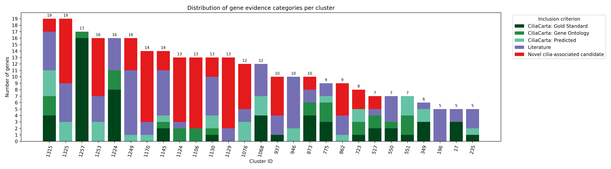
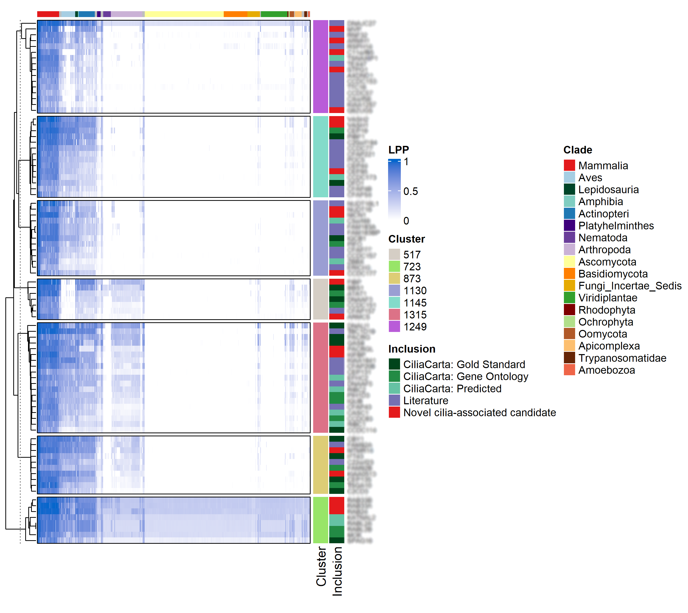

# Project: Ciliary Cluster Computational Pipeline

**Purpose:** This project serves as a **case study** of a **complete computational framework** developed for solving a common challenge in genomics: moving from raw, large-scale phylogenetic data into a validated, functionally-enriched, and **publishable analysis**.

**The Challenge:** In computational biology, moving from raw data to insight is often a non-linear, poorly documented process. The challenge is to create a workflow that is not only scientifically sound but also **transparent, modular, and reproducible.**

**Our Solution (What this code demonstrates):** This repository documents the **step-by-step framework** used for this analysis. The scripts are not just one-off tools; they are the modular components of a reproducible, multi-step pipeline built to systematically filter, enrich, quantify, validate, and visualize these clusters.

---

## 1. Scientific Rationale & Overview

The ciliary system is highly modular. While initial phylogenetic profiling identified major ciliary modules (like IFT and BBS), this pipeline was built to systematically expand upon and quantify this modularity.

The core objective was to take raw cluster data and build a quantitative framework to understand its composition. We systematically classified all cilia-associated clusters (expanding the set from 14 to 27) based on the strength of supporting evidence. Each gene was assigned to a category (e.g., CiliaCarta, Literature, or Novel Candidate), allowing us to move from simple text-based enrichment to a robust analysis of functional subnetworks.

## 2. The Computational Workflow (Chronology)

This project is structured as a chronological pipeline, where each script performs a specific task in the research flow.

### Step 1: Filtering (Data Ingestion)
* **Scientific Goal:** To isolate a high-confidence set of "cilia-related" clusters from a large, raw dataset of 343 genomic clusters.
* **Script:** `extract_cilia_annotations.py`
* **Function:** Reads the master table, searches for specified terms (e.g., "cilia") in annotation columns, and exports a clean, filtered subset of relevant clusters.

### Step 2: Initial Enrichment (CiliaCarta)
* **Scientific Goal:** To perform a systematic, evidence-based classification of every gene within the filtered clusters by cross-referencing them against curated databases (like CiliaCarta) and literature.
* **Script:** `merge_clusters_genes_with_reference.py`
* **Function:** Takes the filtered cluster list (Step 1) and a reference table (e.g., CiliaCarta). It explodes the gene lists and merges them, tagging each gene with its evidence category (e.g., "Gold Standard", "Novel candidate").

### Step 3: Deeper Enrichment (Functional Context)
* **Scientific Goal:** To add deeper functional and phenotypic context beyond CiliaCarta, mapping clusters to biological processes (e.g., motile vs. sensory) and disease associations using sources like GO, KEGG, OMIM, VarElect, and GeneCards.
* **Script:** `extract_subsets_by_terms.py`
* **Function:** A flexible utility script used during this stage to rapidly query the enriched table (Step 2) and extract functional subgroups for downstream analysis (e.g., "all clusters containing 'motile' genes").

### Step 4: Quantification & Analysis
* **Scientific Goal:** To quantitatively analyze the enriched data. How are categories distributed? Which categories appear together? How much do their gene lists overlap?
* **Scripts:**
    * `cluster_annotation_summary.py`: Generates top-level statistics, such as the total count per evidence category (used to create **Figure X1**).
    * `co_occurrence_heatmap_cilia_genes.py`: Calculates a category-by-category matrix (e.g., Jaccard or counts) to answer: "Which *evidence types* (e.g., 'Novel' and 'Literature') tend to appear in the *same clusters*?"
    * `group_overlap_analysis.py`: Calculates a category-by-category matrix to answer: "How much do the *actual gene lists* of each category (e.g., all 'Novel' genes vs. all 'Literature' genes) overlap?"

### Step 5: Validation & Benchmarking
* **Scientific Goal:** To validate our method and findings, particularly our ~100 novel candidate genes.
* **Analysis:** We performed a systematic comparison against a similar published study (Dobbelaere et al., 2023).
* **Key Finding:** This analysis (using cross-tabulation and Venn diagrams) demonstrated that our approach identified 166 unique genes missed by the other study, and confirmed that our "Novel Candidates" conceptually align with their "Unknown [U]" category, validating our method's predictive power.

### Step 6: Visualization
* **Scientific Goal:** To create final, publication-ready figures summarizing the analysis.
* **Scripts:**
    * `cluster_evidence_viz.py`: Generates complex stacked bar plots to visualize the evidence composition of all 27 clusters, as seen in: 
    * `lpp_multi_cluster_heatmap_with_inclusion.R`: (Located in `heatmap_visualization`) Generates the final annotated LPP heatmaps, stratified by evidence category, as seen in 

---

## 3. Scripts in this Project

All Python scripts are robust CLI tools featuring `argparse`, `logging`, and `pathlib` for maximum reproducibility.

| Script | Purpose (One-Liner) |
| :--- | :--- |
| `extract_cilia_annotations.py` | (Step 1) Filters a master table for rows matching specific terms (e.g., "cilia"). |
| `merge_clusters_genes_with_reference.py` | (Step 2) Merges cluster gene lists with an external reference (e.g., CiliaCarta). |
| `cluster_annotation_summary.py` | (Step 4) Generates summary statistics on category counts (powers Fig. X1). |
| `co_occurrence_heatmap_cilia_genes.py` | (Step 4) Calculates co-occurrence of *categories* within clusters. |
| `group_overlap_analysis.py` | (Step 4) Calculates overlap (Jaccard/counts) between *gene lists* of categories. |
| `extract_subsets_by_terms.py` | (Step 3) Utility script to extract specific functional subgroups for analysis. |
| `cluster_evidence_viz.py` | (Step 6) Creates the stacked bar plot of evidence composition (powers Fig. X2). |

*(Note: The R script `lpp_multi_cluster_heatmap_with_inclusion.R`, used for generating the final LPP heatmaps stratified by evidence (Fig. X3), is located in the [`../heatmap_visualization`](../heatmap_visualization) project folder. It demonstrates advanced multi-cluster visualization with annotations.)*

---

## 4. How to Run (Demo Example)

All scripts include a `--help` flag for detailed options. To run this pipeline, you would execute the scripts in chronological order, using the output of one step as the input for the next.

**Example (Step 4 - Summary):**
```bash
# Assumes you have the output from Step 2 (e.g., demo_merged_data.csv)
python scripts/cluster_annotation_summary.py \
    --input data/demo_merged_data.csv \
    --cluster-col "Cluster_ID" \
    --category-col "Inclusion_criterion" \
    --outdir results/summary \
    --top-n 20
````

-----

## 5\. Data & Privacy Disclaimer

⚠️ **All data provided in this project are synthetic and for demonstration purposes only.**

Real datasets (e.g., full NPP matrices, CiliaCarta, patient data) remain confidential and are not included. The demo files (`data/`) are small, randomly generated tables designed *only* to demonstrate the functionality of the Python scripts.
